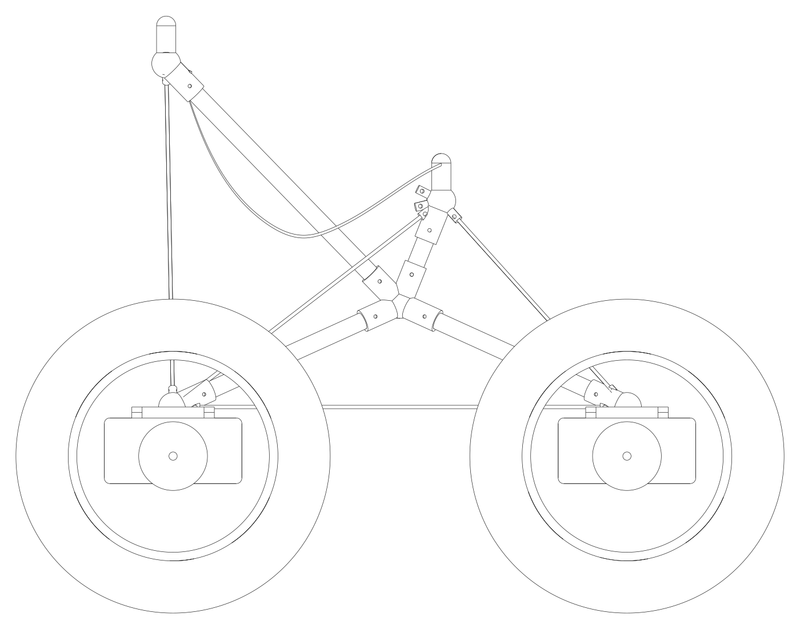

# Playa Sprawler

**Open-source personal mobility optimized for accessibility and maintainability.**
A camp chair on four identical, hot-swappable, self-powered wheel modules — packed into one piece
of Burner Express luggage, rated to the rider's mass down to every tube, joint and cord, and
repaired by a community fleet in under a minute.

Site: **https://playasprawler.outright.io** · structured after [BoardingFlow](https://boardingflow.outright.io/).



## The idea in five lines

1. **Four identical wheel modules** (motor + gearbox + brake + battery + Ethernet node in one brick) dock anywhere on the frame; the dock tells the module which corner it is.
2. **Two identical control modules** (left tread, right tread) — lever, pedal, joystick, sip-puff: any input form publishes the same message.
3. **Ethernet only** for signals (M12 D-coded, UDP multicast pub/sub, no master); a separate SELV power bus. Traction current never crosses a dock.
4. **A rating code in the DNA**: every load-path part is analysed, proof-tested and marked PS-100 / PS-125 / PS-150; the vehicle's rating is the weakest part, enforced on the label and in firmware.
5. **One bag** — 62 linear inches, 50 lb — on the Burner Express bus. This constraint designed the vehicle.

## Repository

```
analysis/    ps_params.py (single source of truth) + truss, stability, energy, flotation, axle, packing → results/
cad/         CadQuery generator: joiners grown from the frame geometry, wheel-module carrier, assembly → exports/ (STEP, STL, SVG)
firmware/    PS-Bus reference simulator (deterministic + real UDP multicast) and message schemas
docs/        methodology, requirements, architecture, rating code, module specs, tests, fleet ops, regulatory, caveats, ADRs, sources
seat/        seat flat pattern (generated)
site/        the single-page site (src/ template + app.js → index.html via scripts/build_site.py)
scripts/     build_site.py, check_ratings.py (CI gate)
.github/     deploy.yml (main → S3 + CloudFront), pr.yml (analysis, CAD, simulator, site preview)
```

## Run it

```bash
pip install -r requirements.txt
cd analysis && python run_all.py            # results/results.md + results.json for all rating classes
cd ../cad && python ps_cad.py               # exports/*.step, *.stl, view_*.svg
python ../firmware/sim/psbus_sim.py --check # scripted hot-swap scenario with assertions
python ../scripts/check_ratings.py          # the rating gate CI runs
python ../scripts/build_site.py             # site/index.html
```

Change a number in `analysis/ps_params.py`; everything downstream regenerates. Never edit a
number in a doc or on the site by hand.

## Headline numbers (PS-125, from `analysis/results/results.md`)

| | |
|---|---|
| Bag | 660 × 450 × 450 mm (61.4 in), **22.49 kg of 22.68 kg** — margin 0.19 kg |
| Wheel module | 16 × 3.0 tubeless on a mini geared hub motor, 7s1p 85.7 Wh, 4.35 kg, 135 mm wide |
| Frame | 25 × 22 CF tube (0.74 kg), 10 printed joiners, 5 mm Dyneema cords, structural canvas seat |
| Worst safety factors, 2.5 g | tube 11.1 · cord 3.7 · seat edge 3.7 · axle 2.1 (assumed steel) |
| Stability | tip at 0.49 g lateral; limiter at 0.25 g; 2.0 m minimum radius at 8 km/h |
| Range | 23 km hard playa · 8 km soft playa · 2.5 km dry loose sand |
| Fail-safe | wheel stops 200 ms after the last valid command, 300 ms ramp |

## Read this first

`docs/13-caveats.md`. There is no prototype yet; the mass margin is 0.8 %; the axle steel is
assumed; the vehicle is only legal in Black Rock City as an Accessibility Vehicle for a rider with
a documented need.

## CI and deployment

Two workflows, mirroring the Outright Mental static-site pattern:

* **`pr.yml`** — on every pull request: analysis, rating gate, CAD export, simulator self-check,
  site build, and a `site-preview` artifact.
* **`deploy.yml`** — on push to `main`: the same build, then `aws s3 sync` to the
  `playasprawler.outright.io` bucket (immutable cache headers on `assets/`, `must-revalidate` on
  `index.html`) and a CloudFront invalidation.

One-time setup for the deploy target:

1. S3 bucket `playasprawler.outright.io` (private, served through CloudFront with an origin access control), default root object `index.html`.
2. CloudFront distribution with an ACM certificate for `playasprawler.outright.io` (us-east-1).
3. Route 53 / DNS: `playasprawler.outright.io` → the distribution.
4. Repository secrets: `AWS_ACCESS_KEY_ID`, `AWS_SECRET_ACCESS_KEY` (an IAM user limited to that bucket and `cloudfront:CreateInvalidation` on that distribution), `AWS_CLOUDFRONT_DISTRIBUTION_ID`.

## License

Hardware CERN-OHL-S-2.0 · software Apache-2.0 · documentation CC-BY-SA-4.0. See `LICENSE.md`.
